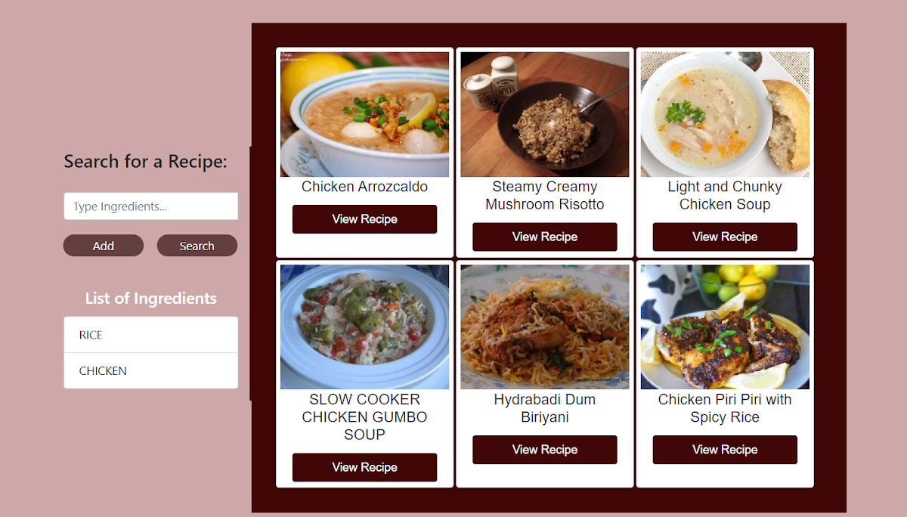
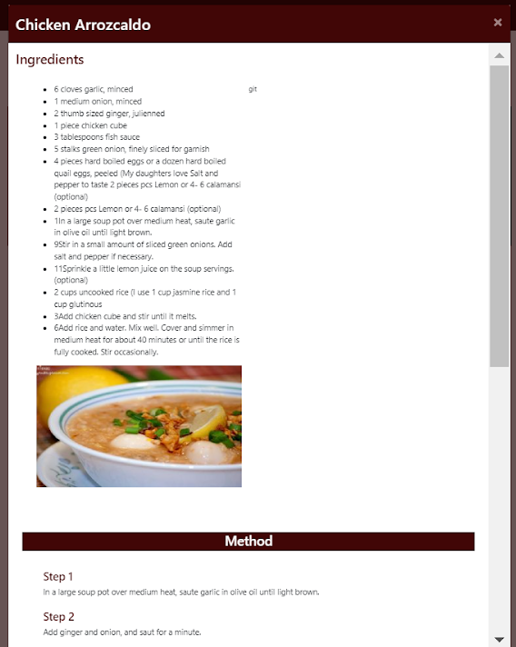

# Recipe Finder

## Description

A web-based recipe finder that allows you to search for delicious recipes based on ingredients you already have at home. With the help of the Spoonacular API, you can search for recipes and get step-by-step instructions on how to cook your favourite meals.

## Features

- Search for recipes based on ingredients you supply
- View detailed instructions on how to cook the recipe

## How to Use

The live site can be found here, [https://fezzer.github.io/recipe-finder/](https://fezzer.github.io/recipe-finder/)

1. Enter ingredients in the search bar
2. View the list of recipes that match your search
3. Select a recipe to view detailed instructions on how to cook the recipe

## Technologies

- JavaScript
- HTML
- CSS
- BOOTSTRAP

## API

The Recipe Finder website uses the Spoonacular API to search for recipes and retrieve instructions. You can get more information about the API and how to get an API key [here](https://spoonacular.com/food-api).

## Developers
- Chris Bowles
- Farinoola Augustine
- Puspita Goswami
- Robert Saunders

## Contribute

We welcome contributions to this project. If you have any ideas or suggestions, feel free to open an issue or send a pull request.

## License

The Recipe Finder website is licensed under the MIT license. You can find more information about the license [here](https://opensource.org/licenses/MIT).
